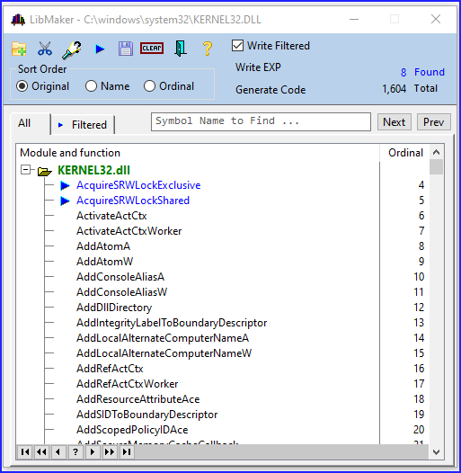
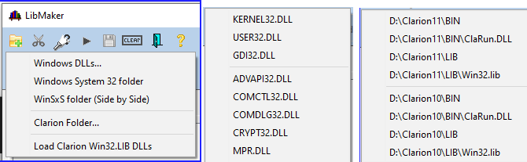
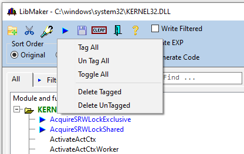
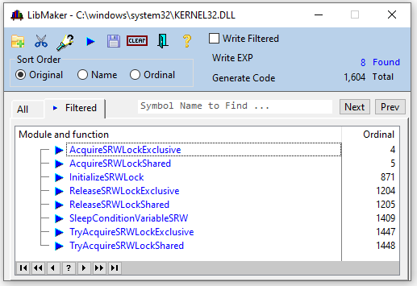
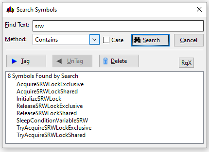
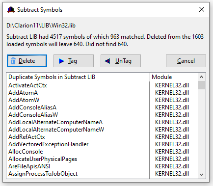
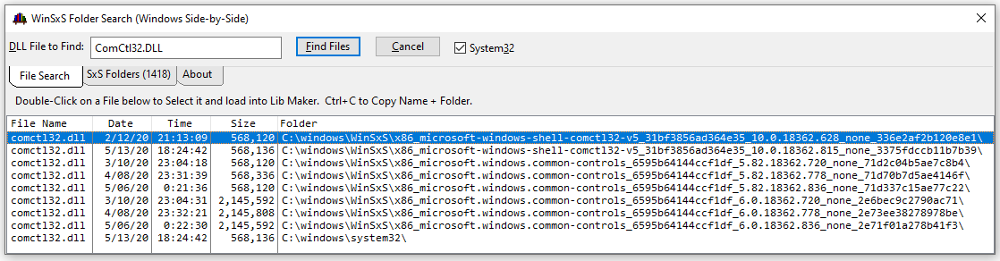

# LibMakerPlus
LibMaker Plus was made for CIDC 2019. It started as Mark Goldberg's [MG LibMaker](https://github.com/MarkGoldberg/ClarionCommunity/tree/master/CW/MGLibMaker). Mark gives credit to Arnor of [Icetips](https://www.icetips.com/) for some of the early work.

This is much more than a simple example. I added many features to make it the most powerful LibMaker for Clarion.

## Main Window

On the Main window is the top toolbar with buttons allow loading a library, subtracting a library, searching,  tagging and creating the LIB file. A locator allows jumping to "Symbol name to find".



Right-click on the buttons and popup menus allow loading the most common libraries without having to navigate to them in the file dialog, or some selections open the file dialog to a specific folder.



### Tagging

Symbols can be tagged in several ways. Double-click or Right-click on a symbol. The tag button popup allows tagging changes for all symbols. Search and subtract allow tagging. They are identified in the list with a blue arrow and text.



The currently tagged symbols can be displayed on the Filtered tab.



### Search for Symbols by Name

Click the Search button (3rd from left) to open the Search window. Text can be matched using several methods. The symbols found can be Tagged, Untagged or Deleted from the main list.



### Subtract Library

I have not seen this feature in any other LibMaker. When you subtract a LIB the symbols in the Subtract LIB that match the currently loaded Symbols can be Tagged, Untagged or Deleted. Normally they would be deleted.

The most common use for this is to subtract Clarion's shipping Win32.lib so you do not get duplicate symbol errors. Another use is to open a new version of a DLL then subtract the prior version to see the new symbols. For example, you might take the Clarion 10 ClaRUN.DLL and subtract the C9 DLL to see what's new.



### Windows Side-by-Side Search and Load

Windows has a WinSxS folder containing version specific DLLs that are loaded by Manifest parameters. If you need a LIB for symbols in Version 6 of the Common Controls DLL (ComCtl32.DLL) this feature makes it easy to make a LIB. For example, if you want a LIB for the new TaskDialog you need ComCtrl32.DLL version 6 and that is only in the WinSxS folder.

To access this window right-click on the Add Library button and select "WinSxS". Fill in the name of the DLL and click Find Files.



## Saving Files

You probably started LibMaker to make a LIB. Normally you would tag the symbols you want and check the box "Write Filtered". The alternative is to delete all the symbols you do not want. To make a LIB click the Save button that looks like a diskette (5th from the left).

The Generate Code button will offer to make you a MAP of the procedures, or a Class Wrapper. These are not complete code but are a nice starting point to fill in the parameters and return value.

#### Map Generate
```clarion
module('KERNEL32.lib')
   AcquireSRWLockExclusive   (				),pascal,raw,dll(1),name('AcquireSRWLockExclusive')
   AcquireSRWLockShared      (				),pascal,raw,dll(1),name('AcquireSRWLockShared')
   InitializeSRWLock         (				),pascal,raw,dll(1),name('InitializeSRWLock')
   ReleaseSRWLockExclusive   (				),pascal,raw,dll(1),name('ReleaseSRWLockExclusive')
   ReleaseSRWLockShared      (				),pascal,raw,dll(1),name('ReleaseSRWLockShared')
end !module('KERNEL32.lib')
```

#### Class Generate .INC
```clarion
ctKERNEL32  CLASS,TYPE,MODULE('ctKERNEL32.clw'),LINK('ctKERNEL32.clw') !,_YadaLinkMode),DLL(_YadaDllMode)
CONSTRUCT                  PROCEDURE()
DESRTRUCT                  PROCEDURE()
AcquireSRWLockExclusive    PROCEDURE(   )
AcquireSRWLockShared       PROCEDURE(   )
InitializeSRWLock          PROCEDURE(   )
ReleaseSRWLockExclusive    PROCEDURE(   )
ReleaseSRWLockShared       PROCEDURE(   )
            END
```

#### Class Generate .CLW
```clarion
MEMBER()
  MAP
    AcquireSRWLockExclusive    (				),pascal,raw,dll(1),name('AcquireSRWLockExclusive')
    AcquireSRWLockShared       (				),pascal,raw,dll(1),name('AcquireSRWLockShared')
    InitializeSRWLock          (				),pascal,raw,dll(1),name('InitializeSRWLock')
    ReleaseSRWLockExclusive    (				),pascal,raw,dll(1),name('ReleaseSRWLockExclusive')
    ReleaseSRWLockShared       (				),pascal,raw,dll(1),name('ReleaseSRWLockShared')
  END
  INCLUDE('ctKERNEL32.inc'),ONCE
ctKERNEL32.CONSTRUCT                  PROCEDURE(  )
  CODE
ctKERNEL32.DESTRUCT                   PROCEDURE(  )
  CODE
ctKERNEL32.AcquireSRWLockExclusive    PROCEDURE(  )
  CODE
ctKERNEL32.AcquireSRWLockShared       PROCEDURE(  )
  CODE
ctKERNEL32.InitializeSRWLock          PROCEDURE(  )
  CODE
ctKERNEL32.ReleaseSRWLockExclusive    PROCEDURE(  )
  CODE
ctKERNEL32.ReleaseSRWLockShared       PROCEDURE(  )
  CODE
```
